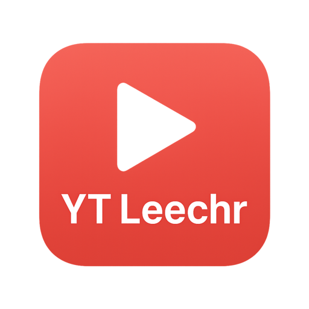

  

  <strong>A modern, cross-platform graphical user interface for <a href="https://github.com/yt-dlp/yt-dlp">yt-dlp</a></strong>

  
  
  
  
  

---

## Quick Start

**Ready to use? Download the latest release for your platform:**

- **📥 [Download for Windows](https://github.com/buggerman/yt-leechr/releases/latest)** - Standalone `.exe` executable
- **📥 [Download for macOS](https://github.com/buggerman/yt-leechr/releases/latest)** - Native `.app` bundle
- **📥 [Download for Linux](https://github.com/buggerman/yt-leechr/releases/latest)** - Portable executable
- **📦 [Install via Flathub](installation#flatpak)** - Universal Linux package with sandboxing

*No installation required! Just download and run.*

## Features

### 🎯 Core Features
- **🖥️ Intuitive Interface**: Clean, modern GUI with drag-and-drop support
- **📋 Queue Management**: Download multiple videos with real-time progress tracking
- **🎞️ Format Selection**: Choose video quality, extract audio, and customize output formats
- **🎬 Playlist Support**: Download entire playlists or select specific videos
- **📑 Subtitle Support**: Download and embed subtitles in multiple languages
- **🌍 Cross-Platform**: Native builds for Windows, macOS, and Linux

### 🎨 User Experience
- **🌙 Dark Mode**: Supports light, dark, and system themes
- **⚡ High-Quality Icons**: Custom-designed icons for crisp display on all platforms
- **🖱️ Context Menus**: Right-click for advanced options like retry, pause, and folder access
- **⌨️ Keyboard Shortcuts**: Quick access to common functions
- **📱 Responsive Design**: Scales beautifully on different screen sizes

### 🔧 Advanced Features
- **🔀 Batch Downloads**: Paste multiple URLs for simultaneous downloads
- **📁 Custom File Naming**: Flexible templates with variables like title, uploader, date
- **⚙️ Advanced Settings**: Full access to yt-dlp options for power users
- **🔄 Retry Logic**: Automatic retry on failed downloads with exponential backoff
- **📊 Progress Analytics**: Detailed download statistics and speed monitoring

## Documentation

- **[Installation Guide](installation)** - Complete installation instructions for all platforms
- **[User Guide](user-guide)** - How to use YT Leechr effectively
- **[Configuration](configuration)** - Customize settings and preferences
- **[Development](development)** - Build from source and contribute
- **[Testing](testing)** - Test suite information and running tests
- **[Troubleshooting](troubleshooting)** - Common issues and solutions

## Supported Sites

YT Leechr supports the same sites as yt-dlp, including:
- YouTube
- Vimeo
- Dailymotion
- Twitch
- And [many more](https://github.com/yt-dlp/yt-dlp/blob/master/supportedsites.md)

## Support

- 📖 [Documentation](https://buggerman.github.io/yt-leechr/)
- 🐛 [Report Issues](https://github.com/buggerman/yt-leechr/issues)
- 💬 [Discussions](https://github.com/buggerman/yt-leechr/discussions)
- ⭐ Star the repo if you find it useful!

---

<strong>Made with ❤️ for the open source community</strong>

