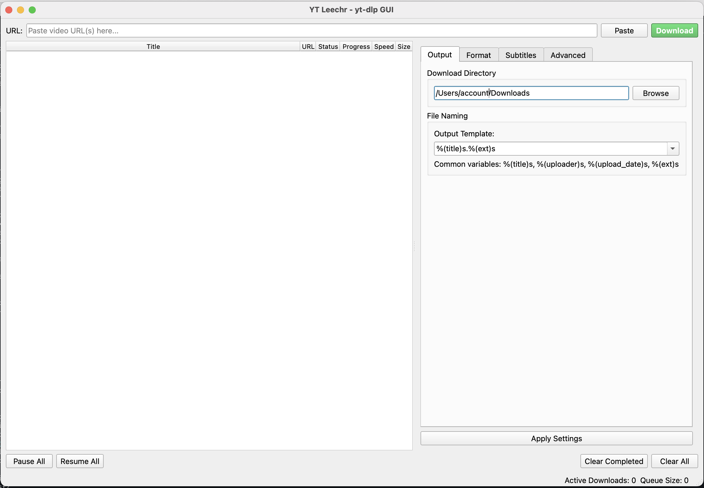

# User Guide

Learn how to use YT Leechr to download videos and audio from hundreds of websites with advanced features and customization options.

## Getting Started

### First Launch

1. **Launch YT Leechr** from your applications menu or by running the executable
2. **Configure output directory** in Settings (optional)
3. **Paste a video URL** in the input field
4. **Click Download** to start

### Basic Download

1. **Copy a video URL** (YouTube, Vimeo, etc.)
2. **Paste URL** in the input field at the top
3. **Click "Download"** or press Enter
4. **Monitor progress** in the download queue

## Interface Overview

### Main Window

- **URL Input Field**: Paste video URLs here
- **Download Button**: Start downloads
- **Download Queue**: Shows all downloads with progress
- **Settings Panel**: Configure download options (toggle with gear icon)
- **Menu Bar**: Access themes, help, and advanced features

### Download Queue

Each download shows:
- **Thumbnail**: Video preview image
- **Title**: Video title and uploader
- **Progress**: Download percentage and speed
- **Status**: Downloading, completed, error, or paused
- **Actions**: Right-click for context menu

## Core Features

### Single Downloads

1. Paste any supported video URL
2. Configure quality/format in settings (optional)
3. Click Download
4. Wait for completion

### Batch Downloads

1. **Paste multiple URLs** (one per line) in the input field
2. **Click Download** - all URLs will be queued
3. **Downloads process** according to concurrent limit settings

### Playlist Downloads

1. **Paste playlist URL** (YouTube, Vimeo, etc.)
2. **Choose playlist options** in Advanced settings
3. **Download entire playlist** or select specific videos

## Settings and Configuration

### Output Settings

**Output Directory:**
- Choose where downloads are saved
- Default: Downloads folder in your home directory

**File Naming:**
- Customize filename templates
- Use variables like `%(title)s`, `%(uploader)s`, `%(upload_date)s`
- Examples:
  - `%(title)s.%(ext)s` - Simple title
  - `%(uploader)s - %(title)s.%(ext)s` - Include uploader
  - `%(upload_date)s - %(title)s.%(ext)s` - Include date

### Quality and Format

**Video Quality:**
- Best available (default)
- Specific resolution (1080p, 720p, 480p, etc.)
- Audio only extraction

**Audio Format:**
- MP3, M4A, OGG, FLAC
- Quality settings for audio extraction

**Video Format:**
- MP4 (recommended for compatibility)
- MKV, WEBM, AVI
- Original format (no conversion)

### Advanced Options

**Concurrent Downloads:**
- Number of simultaneous downloads (1-5)
- Higher numbers may impact performance

**Subtitle Options:**
- Download subtitles in multiple languages
- Embed subtitles in video files
- Save as separate files

**Custom yt-dlp Arguments:**
- Add any yt-dlp command-line options
- For power users and special requirements

## Advanced Features

### Context Menu

Right-click any download for options:
- **Retry**: Restart failed downloads
- **Pause/Resume**: Control download state
- **Copy URL**: Copy original video URL
- **Open Folder**: Open download location
- **Remove**: Remove from queue

### Keyboard Shortcuts

- **Ctrl+V / Cmd+V**: Paste clipboard content to URL field
- **Enter**: Add current URL to download queue
- **Delete**: Remove selected downloads from queue
- **F5**: Refresh download information

### Themes

Switch between themes via View menu:
- **Light Theme**: Traditional light interface
- **Dark Theme**: Modern dark interface
- **System Theme**: Follow system preferences

### Drag and Drop

- **Drag URLs** from web browsers directly to the input field
- **Drag text files** containing URLs for batch downloads

## Tips and Best Practices

### Download Optimization

1. **Use appropriate quality** - higher quality = larger files and slower downloads
2. **Limit concurrent downloads** on slower connections
3. **Choose efficient formats** (MP4 for video, MP3 for audio)
4. **Use audio-only** for music/podcasts to save bandwidth

### File Organization

1. **Use descriptive naming templates** with uploader and date
2. **Organize by content type** using different output directories
3. **Create folder structures** using template variables like `%(uploader)s/%(title)s`

### Troubleshooting Downloads

1. **Check URL validity** - ensure the video is publicly accessible
2. **Try different quality settings** if downloads fail
3. **Use retry function** for temporary network issues
4. **Check Advanced settings** for region-specific content

## Supported Sites

YT Leechr works with hundreds of sites including:

### Video Platforms
- YouTube (videos, playlists, channels)
- Vimeo
- Dailymotion
- Twitch (videos and clips)

### Social Media
- Twitter/X
- Instagram
- TikTok
- Facebook

### Educational
- Khan Academy
- Coursera
- edX
- MIT OpenCourseWare

### And Many More
See the complete [supported sites list](https://github.com/yt-dlp/yt-dlp/blob/master/supportedsites.md).

## Getting Help

### Common Issues

**Download fails:**
- Check if the video is still available
- Try different quality settings
- Ensure internet connection is stable

**Slow downloads:**
- Reduce concurrent download limit
- Check network speed
- Try downloading during off-peak hours

**FFmpeg errors:**
- Ensure FFmpeg is properly installed
- Check PATH environment variable
- Restart application after installing FFmpeg

### Support Resources

- 📖 [Configuration Guide](configuration) for detailed settings
- 🔧 [Troubleshooting](troubleshooting) for common problems
- 🐛 [Report Issues](https://github.com/buggerman/yt-leechr/issues) for bugs
- 💬 [Discussions](https://github.com/buggerman/yt-leechr/discussions) for questions

---

[← Installation](installation) | [Next: Configuration →](configuration)